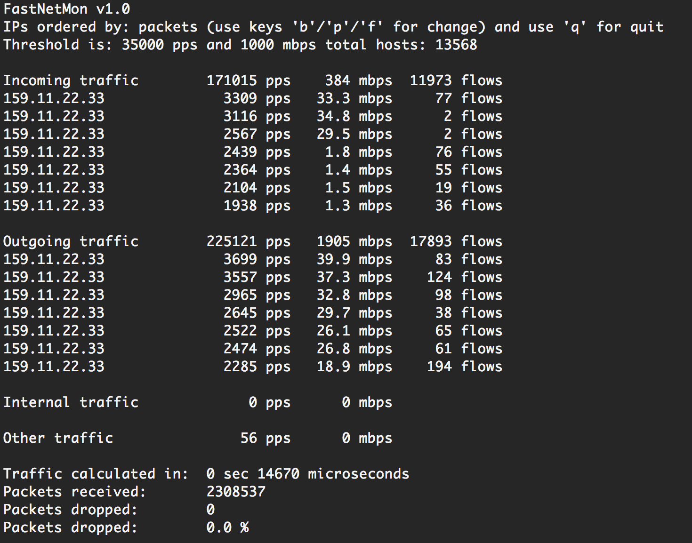

Community Edition
===========
FastNetMon - A high performance DoS/DDoS load analyzer built on top of multiple packet capture engines (NetFlow, IPFIX, sFlow, SnabbSwitch, netmap, PF_RING, PCAP).

What do we do?
--------------
We detect hosts in the deployed network sending or receiving large volumes of traffic, packets/bytes/flows, per second and
perform a configurable action to handle that event. These configurable actions include notifying you, switching off the server, or blackholing the client.

What is a "flow" in FastNetMon terms?  It's one or more ICMP, UDP, or TCP connections with can be identified by via its unique src IP, dst IP, src port, dst port, and protocol usage.

Integration with flow systems
-----------------------------
At a very high level integration with FastNetMon is fairly simple. In both cases the work flow is the same and the main difference being the port numbers provided. The port numbers are configurable.

#### sFlow
Configure the IP of the server running FastNetMon using port 6343. This port number is configurable.

#### Netflow
Configure the IP of the server running FastNetMon using port 2055. This port number is configurable.

License: GPLv2

Project 
-------
- [Official site](https://fastnetmon.com)
- [Mailing list](https://groups.google.com/forum/#!forum/fastnetmon)
- [Slack](https://join.slack.com/t/fastnetmon/shared_invite/MjM3NDUwNzY4NjA5LTE1MDQ4MzE5NTAtYmU4MjYyYWNiZQ)
- [FastNetMon Advanced, Commercial Edition](https://fastnetmon.com/fastnetmon-advanced/)
- If you want add an [idea](https://fastnetmon.fider.io/)
- Chat: #fastnetmon at irc.freenode.net [web client](https://webchat.freenode.net/)
- Detailed reference in Russian: [link](https://fastnetmon.com/wp-content/uploads/2017/07/FastNetMon_Reference_Russian.pdf)

Supported packet capture engines
--------------------------------
- NetFlow v5, v9
- IPFIX
-  v4 (since 1.1.3), v5
- Port mirror/SPAN capture with PF_RING (with ZC/DNA mode support [need license](http://www.ntop.org/products/pf_ring/)), SnabbSwitch, NETMAP and PCAP

You can check out the [comparison table](https://fastnetmon.com/docs/capture_backends/) for all available packet capture engines.

Complete integration with the following vendors 
--------------------------------
- [A10 Networks Thunder TPS Appliance integration](src/a10_plugin)
- [MikroTik RouterOS](src/mikrotik_plugin) Please use only recent versions of RouterOS!

Travis status: 

Features
--------
- Complete [BGP Flow Spec support](https://fastnetmon.com/docs/bgp_flow_spec/), RFC 5575
- Process and distinguish incoming and/or outgoing traffic
- Trigger block/notify script if an IP exceeds defined thresholds for packets/bytes/flows per second
- Thresholds can be configured per-subnet with the hostgroups feature
- [Announce blocked IPs](https://fastnetmon.com/docs/exabgp_integration/) via BGP to routers with [ExaBGP](https://github.com/Exa-Networks/exabgp)
- GoBGP [integration](https://fastnetmon.com/docs/gobgp-integration/) for unicast IPv4 announcements (you will need to build support for this manually).
- Full integration with [Graphite](https://fastnetmon.com/docs/graphite_integration/) and [InfluxDB](https://fastnetmon.com/docs/influxdb_integration/)
- API (you will need to build support for this manually)
- [Redis](https://fastnetmon.com/docs/redis/) integration
- [MongoDB](https://fastnetmon.com/docs/mongodb/) integration
- Deep Packet Inspection (DPI) for attack traffic
- netmap support (open source; wire speed processing; only Intel hardware NICs or any hypervisor VM type)
- SnabbSwitch support (open source, very flexible, LUA driven, very-very-very fast)
- Filter NetFlow v5 flows or sFLOW packets with LUA scripts (useful for excluding particular ports)
- Supports L2TP decapsulation, VLAN untagging and MPLS processing in mirror mode 
- Works on server/soft-router
- Detects DoS/DDoS in as little as 1-2 seconds
- [Tested](https://fastnetmon.com/docs/performance_tests/) up to 10Gbps with 12Mpps on an Intel i7-3820 processor with an Intel 82599 NIC
- Complete plug-in support
- Capture attack fingerprints in PCAP format
- [Complete support](https://fastnetmon.com/docs/detected_attack_types/) for most popular attack types

Running Fastnetmon
------------------
### Supported platforms
- Linux (Debian 6/7/8/9, CentOS 6/7, Ubuntu 12.04, 14.04, 16.04)
- FreeBSD 9, 10, 11: [official port](https://www.freshports.org/net-mgmt/fastnetmon/).
- Mac OS X Yosemite (only 1.1.2 release)

### Supported architectures
- x86 64-bit (recommended)
- x86 32-bit

### Hardware requirements
- At least 1 GB of RAM for compilation purposes

### Router integration instructions
- [Juniper MX Routers](https://fastnetmon.com/docs/junos_integration/)

### Distributions supported
- We are part of the [CloudRouter](https://cloudrouter.org/cloudrouter/2015/07/09/fastnetmon.html) distribution
- We are part of the [official FreeBSD ports collection](https://freshports.org/net-mgmt/fastnetmon/)
- [Docker image](https://fastnetmon.com/fastnetmon-community-docker-install/)
- [Automatic install script for Debian/Ubuntu/CentOS/Fedora/Gentoo](https://fastnetmon.com/install/)
- [Automatic install script for Mac OS X](https://fastnetmon.com/fastnetmon-macos/)
- [Manual install on Slackware](https://fastnetmon.com/fastnetmon-community-slackware-install/)
- [Manual install on VyOS](https://fastnetmon.com/fastnetmon-community-install-on-vyos-1-1-5/)

Screenshots
------------

Main program:

Example CPU load on Intel i7-2600 with Intel X540/82599 NIC at 400Kpps load:

Example deployment scheme:

Example of [notification email](https://fastnetmon.com/docs/attack_report_example/) about detected attack:

Author: [Pavel Odintsov](http://uk.linkedin.com/in/podintsov/)

Follow us at [Twitter](https://twitter.com/fastnetmon) and [LinkedIn](https://www.linkedin.com/company/fastnetmon/)
